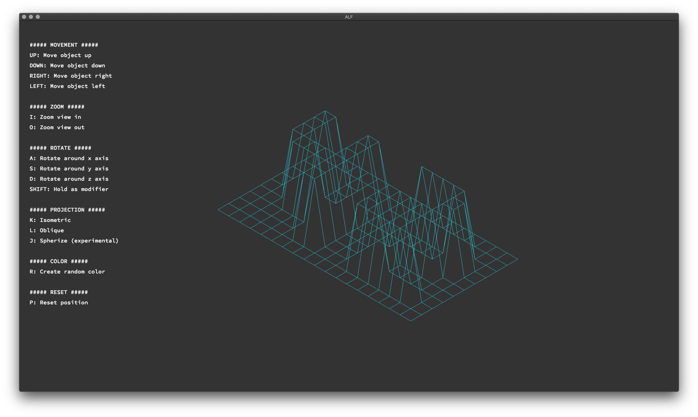

<h1 align="center">
    <p>
        📓 FdF
    </p>
</h1>

<p align="center">
    <b><i>Repo for the FdF project at 42 Heilbronn</i></b>
</p>

<p align="center">
    This repository is coded in&nbsp&nbsp
    <a href="https://skillicons.dev">
        
    </a>
     &nbsp&nbspwith&nbsp&nbsp
    <a href="https://skillicons.dev">
        
    </a>
</p>

<h3 align="center">
    Status
</h3>

<p align="center">
    Finished: <br>
    Grade: %
</p>

---

## 💾 About
> The task of the FdF (fil det fer) project is to code my first graphics program using the [MLX42](https://github.com/codam-coding-college/MLX42) library.

## Requirements
* MLX42 library

## Usage
FdF is being used by ./FDF [map.fdf] where the map is located in the [maps](./maps/) folder and has to end with a _.fdf_.

Minitalk has 2 programs that communicate with each other. The _server_ has to be started first in a separate terminal using `./server`
and then the _client_ can be used to send a message to the server. This can be done using the syntax: `./client PID "message"`
where PID is the process number that the server printed out on startup. After sending the message from the client, 
the server sends back an acknowledgment signal and the client prints out the acknowledged bytes.

## Examples


```bash
git clone --recurse-submodules https://github.com/kurz-m/FdF.git
```

```bash
cd FdF
```
```bash
make
```
```bash
./FdF [map.fdf]
```
