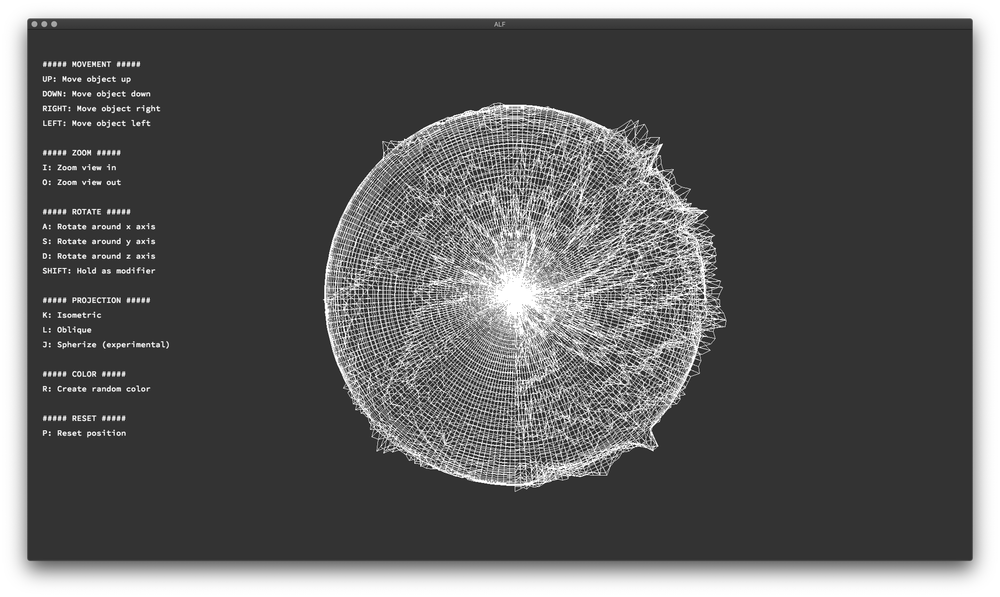

<h1 align="center">
    <p>
        📓 FdF
    </p>
</h1>

<p align="center">
    <b><i>Repo for the FdF project at 42 Heilbronn</i></b>
</p>

<p align="center">
    This repository is coded in&nbsp&nbsp
    <a href="https://skillicons.dev">
        
    </a>
     &nbsp&nbspwith&nbsp&nbsp
    <a href="https://skillicons.dev">
        
    </a>
</p>

<h3 align="center">
    Status
</h3>

<p align="center">
    Finished: 24/05/2023<br>
    Grade: 125%
</p>

---

## 💾 About
> The task of the FdF (fil de fer) project is to code my first graphics program using the [MLX42](https://github.com/codam-coding-college/MLX42) library.




## Requirements
* [MLX42](https://github.com/codam-coding-college/MLX42)
* [Libft](https://github.com/kurz-m/Libft)
* [CMake](https://cmake.org/)
* [glfw](https://github.com/glfw/glfw)

## Usage
FdF is being used by ./FDF [map.fdf] where the map is located in the [maps](./maps/) folder and has to end with a _.fdf_.
As long as all requirements are installed, a basic `make` in the root directory of [FdF](./) is sufficient. Large maps need
longer to load.

Regarding the different projections, _spherize_ is still in an experimental stage and produces interesting art when rotated.

```bash
git clone --recurse-submodules https://github.com/kurz-m/FdF.git
```

```bash
cd FdF
```
```bash
make
```
```bash
./FdF [map.fdf]
```
